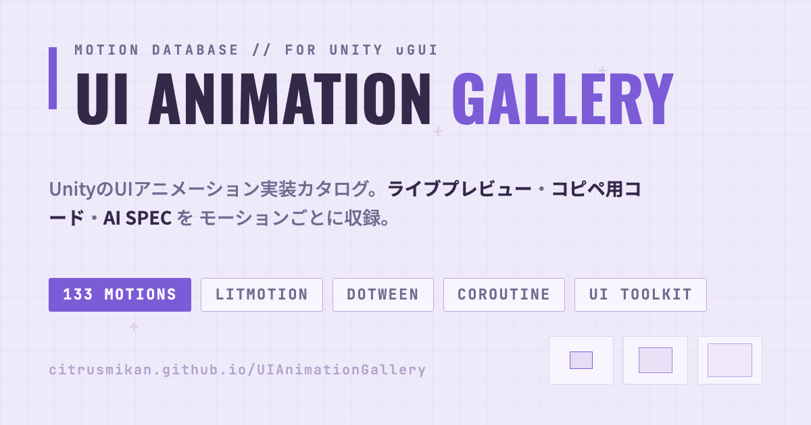

# UIAnimationGallery

[](https://citrusmikan.github.io/UIAnimationGallery/index.html)

UnityのUIアニメーション実装カタログ。133種のモーションを、ブラウザで動くライブプレビューとコピペ用の実装コード付きで収録しています。

### ▶ [デモを見る](https://citrusmikan.github.io/UIAnimationGallery/index.html)

## 特徴

- **ライブプレビュー** — Unityと同じイージング計算でブラウザ上に再現。カード上で直接クリック・ホバーして試せます
- **4系統の実装コード** — LitMotion / DOTween / Coroutine / UI Toolkit のコピペ用ソースを各モーションに用意
- **AI SPEC** — AIに貼るだけで同じ動きを実装させられるJSON仕様書付き
- **9カテゴリ** — 出現・退場 / 強調・ループ / ボタン・操作 / UI部品 / テキスト・数値 / ローディング・進捗 / リスト・レイアウト / モダンWeb・モーション / 画面遷移・Material
- **6テーマ** — dark / light / sakura / mint / lavender / ocean

## 使い方

ビルド・依存パッケージ・サーバーは不要です。`index.html` をブラウザで開くだけで動きます。

```
index.html?open=fade-in&tab=dotween   # 特定のモーションを開いた状態で表示
index.html?theme=ocean                # テーマを指定して表示
```

## ライセンス

[MIT License](LICENSE)
